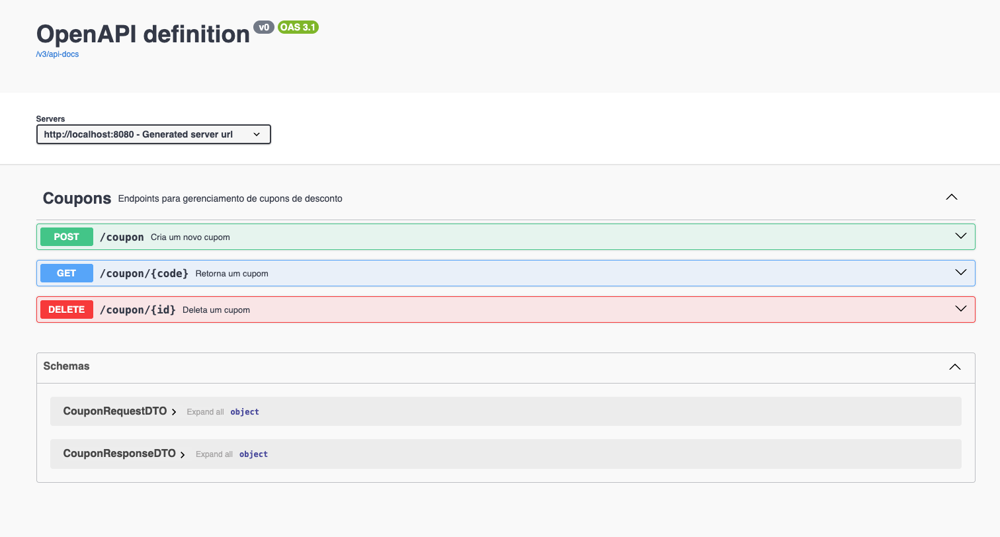
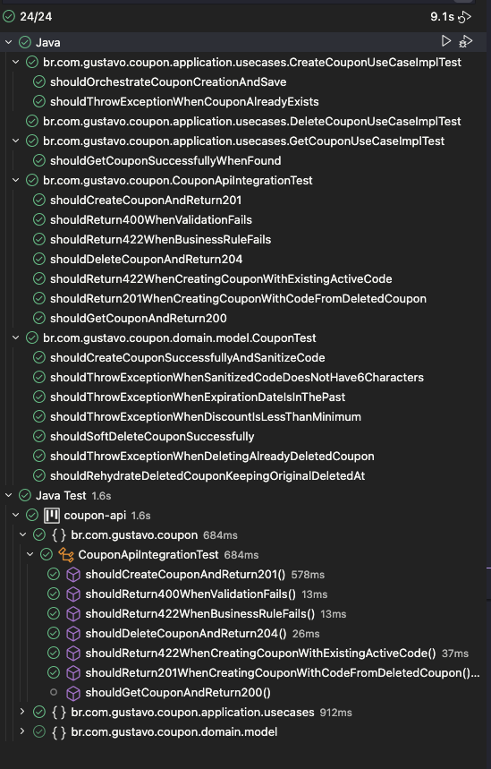
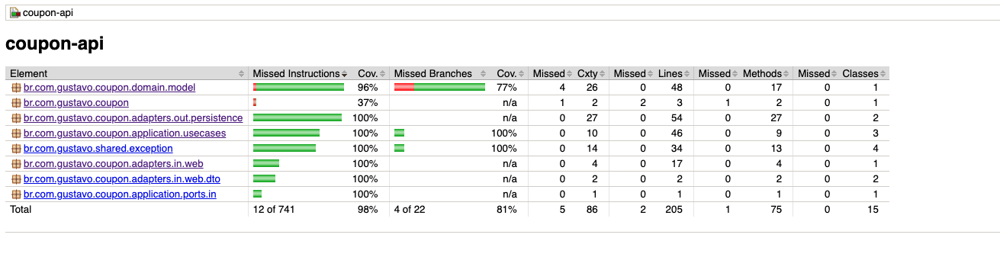

# Coupon API

API REST para gerenciamento de cupons com Spring Boot.

## Arquitetura

Este projeto adota Arquitetura Hexagonal (Ports & Adapters), com o objetivo de manter o núcleo de negócio isolado de detalhes externos.

Centro do hexágono:

- `src/main/java/br/com/gustavo/coupon/domain`
- `src/main/java/br/com/gustavo/coupon/application/usecases`
- `src/main/java/br/com/gustavo/coupon/application/ports`

Lado esquerdo (driving adapters):

- `src/main/java/br/com/gustavo/coupon/adapters/in/web`

Lado direito (driven adapters):

- `src/main/java/br/com/gustavo/coupon/adapters/out/persistence`

Fluxo principal:

`HTTP -> Adapter In -> Use Case -> Domain -> Port Out -> Adapter Out -> Database`

## Tecnologias

- Java 21
- Spring Boot 4.0.3
- Spring Web MVC
- Spring Data JPA
- H2 Database
- Springdoc OpenAPI (Swagger)
- JUnit 5 / Mockito / MockMvc
- Docker / Docker Compose

## Pré-requisitos

- JDK 21 instalado
- Docker e Docker Compose (opcional, para execução em container)

## Variáveis de ambiente

1. Crie seu arquivo local:

```bash
cp .env.example .env
```

2. Opcional para execução local com Maven:

```bash
set -a
source .env
set +a
```

## Executando localmente

1. Compile o projeto:

```bash
./mvnw clean package -DskipTests
```

2. Suba a aplicação:

```bash
./mvnw spring-boot:run
```

3. URLs úteis:

- API: `http://localhost:8080`
- Swagger UI: `http://localhost:8080/swagger-ui.html`
- OpenAPI JSON: `http://localhost:8080/v3/api-docs`
- H2 Console: `http://localhost:8080/h2-console`

## Executando com Docker

1. Gere o `.jar`:

```bash
./mvnw clean package -DskipTests
```

2. Garanta que existe `.env` (ex: `cp .env.example .env`).

3. Suba com Docker Compose:

```bash
docker-compose up --build
```

4. Para derrubar:

```bash
docker-compose down
```

## Endpoints principais

- `POST /coupon`
- `DELETE /coupon/{id}`

## Testes

Rodar suíte completa:

```bash
./mvnw test
```

Rodar apenas integração + domínio:

```bash
./mvnw -Dtest=CouponApiIntegrationTest,CouponTest test
```

Relatório de cobertura (JaCoCo):

- Gerado em: `target/site/jacoco/index.html`

## Swagger

A documentação interativa está disponível em:

- `http://localhost:8080/swagger-ui.html`

## Espaço para prints

Print 1 - Swagger UI:



Print 2 - Testes passando:




